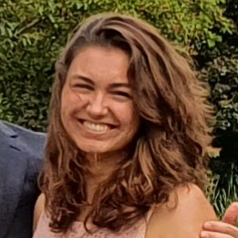

```{r, include=FALSE}
knitr::opts_chunk$set(
  results='asis', 
  echo = FALSE
)
library(tidyverse)
library(glue)

# Set this to true to have links turned into footnotes at the end of the document
PDF_EXPORT <- FALSE

# Holds all the links that were inserted for placement at the end
links <- c()

source('parsing_functions.R') # Functions for building sections from CSV data
source('common_variables.R')  # Small variables for non-csv data such as intro text

# First let's get the data, filtering to only the items tagged as
# Resume items
position_data <- read.csv('positions.csv') %>% 
  filter(in_resume) %>% 
  mutate(
    # Build some custom sections by collapsing others
    section = case_when(
      section %in% c('research_positions', 'industry_positions') ~ 'positions', 
      section %in% c('data_science_writings', 'by_me_press') ~ 'writings',
      TRUE ~ section
    )
  ) 

```


Aside
================================================================================


{width=100%}

Contact {#contact}
--------------------------------------------------------------------------------


- <i class="fa fa-envelope"></i> lastoel@gmail.com
- <i class="fa fa-github"></i> [github.com/lastoel](github.com/lastoel)
- <i class="fa fa-link"></i> [nickstrayer.me](http://nickstrayer.me/)


Programming Skills {#skills}
--------------------------------------------------------------------------------


```{r}
build_skill_bars(Progskills)
```

Language Skills {#skills}
--------------------------------------------------------------------------------
```{r}
build_skill_bars(Langskills)
```


More info {#more-info}
--------------------------------------------------------------------------------

See full CV at nickstrayer.me/cv for more complete list of positions and publications.


Disclaimer {#disclaimer}
--------------------------------------------------------------------------------

Made w/ [**pagedown**](https://github.com/rstudio/pagedown). 

Source code: [github.com/nstrayer/cv](https://github.com/nstrayer/cv).

Last updated on `r Sys.Date()`.


Main
================================================================================

Lauke Stoel {#title}
--------------------------------------------------------------------------------

```{r}
cat(sanitize_links(intro_text))
```


Education {data-icon=graduation-cap data-concise=true}
--------------------------------------------------------------------------------

```{r}
position_data %>% print_section('education')
```


Selected Positions {data-icon=suitcase}
--------------------------------------------------------------------------------

```{r}
position_data %>% print_section('positions')
```

Extracurricular {data-icon=chart-line}
--------------------------------------------------------------------------------

```{r, results = 'asis'}
position_data %>% print_section('extracurricular')
```

Research Contributions {data-icon=laptop}
--------------------------------------------------------------------------------

```{r}
position_data %>% print_section('research')
```

Selected Writing {data-icon=newspaper}
--------------------------------------------------------------------------------

```{r}
position_data %>% print_section('writings')
```


